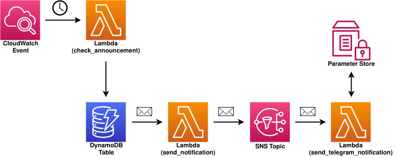

# Infrastructure as code

Terraform code to deploy the infrastructure.

## Architecture

<!-- BEGINNING OF PRE-COMMIT-TERRAFORM DOCS HOOK -->
## Requirements

| Name | Version |
|------|---------|
|  [terraform](#requirement\_terraform) | 1.0.0 |
|  [aws](#requirement\_aws) | 3.44.0 |

## Providers

| Name | Version |
|------|---------|
|  [aws](#provider\_aws) | 3.44.0 |

## Modules

| Name | Source | Version |
|------|--------|---------|
|  [check\_announcement\_lambda](#module\_check\_announcement\_lambda) | ./modules/lambda | n/a |
|  [send\_notification\_lambda](#module\_send\_notification\_lambda) | ./modules/lambda | n/a |
|  [send\_telegram\_notification\_lambda](#module\_send\_telegram\_notification\_lambda) | ./modules/lambda | n/a |

## Resources

| Name | Type |
|------|------|
| [aws_cloudwatch_event_rule.check_announcement_lambda](https://registry.terraform.io/providers/hashicorp/aws/3.44.0/docs/resources/cloudwatch_event_rule) | resource |
| [aws_cloudwatch_event_target.check_announcement_lambda](https://registry.terraform.io/providers/hashicorp/aws/3.44.0/docs/resources/cloudwatch_event_target) | resource |
| [aws_dynamodb_table.default](https://registry.terraform.io/providers/hashicorp/aws/3.44.0/docs/resources/dynamodb_table) | resource |
| [aws_lambda_event_source_mapping.dynamodb_send_notification_lambda](https://registry.terraform.io/providers/hashicorp/aws/3.44.0/docs/resources/lambda_event_source_mapping) | resource |
| [aws_sns_topic.default](https://registry.terraform.io/providers/hashicorp/aws/3.44.0/docs/resources/sns_topic) | resource |
| [aws_sns_topic_subscription.default](https://registry.terraform.io/providers/hashicorp/aws/3.44.0/docs/resources/sns_topic_subscription) | resource |
| [aws_ssm_parameter.telegram_auth_token](https://registry.terraform.io/providers/hashicorp/aws/3.44.0/docs/resources/ssm_parameter) | resource |
| [aws_iam_policy_document.dynamodb_check_announcement_lambda](https://registry.terraform.io/providers/hashicorp/aws/3.44.0/docs/data-sources/iam_policy_document) | data source |
| [aws_iam_policy_document.dynamodb_send_notification_lambda](https://registry.terraform.io/providers/hashicorp/aws/3.44.0/docs/data-sources/iam_policy_document) | data source |
| [aws_iam_policy_document.sns_send_notification_lambda](https://registry.terraform.io/providers/hashicorp/aws/3.44.0/docs/data-sources/iam_policy_document) | data source |
| [aws_iam_policy_document.ssm_send_telegram_notification_lambda](https://registry.terraform.io/providers/hashicorp/aws/3.44.0/docs/data-sources/iam_policy_document) | data source |

## Inputs

| Name | Description | Type | Default | Required |
|------|-------------|------|---------|:--------:|
|  [announcements](#input\_announcements) | Target announcements checks | <pre>map(object({     base_url           = string     date_format        = string     telegram_chat_id   = string     telegram_chat_name = string   }))</pre> | n/a | yes |
|  [prefix](#input\_prefix) | Unique prefix name to identify the resources | `string` | `""` | no |
|  [region](#input\_region) | AWS region | `string` | `"eu-west-1"` | no |
|  [schedule\_expression](#input\_schedule\_expression) | Scheduling expression to check a new announcement | `string` | n/a | yes |
|  [tags](#input\_tags) | A map of tags to add | `map(string)` | <pre>{   "App": "cann",   "CreatedBy": "terraform",   "Environment": "production" }</pre> | no |
|  [telegram\_auth\_token](#input\_telegram\_auth\_token) | Telegram Auth Token to publish new announcements | `string` | n/a | yes |

## Outputs

No outputs.
<!-- END OF PRE-COMMIT-TERRAFORM DOCS HOOK -->
